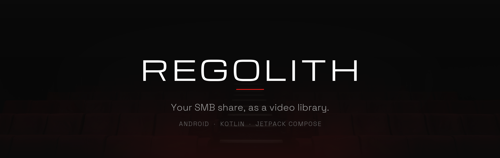
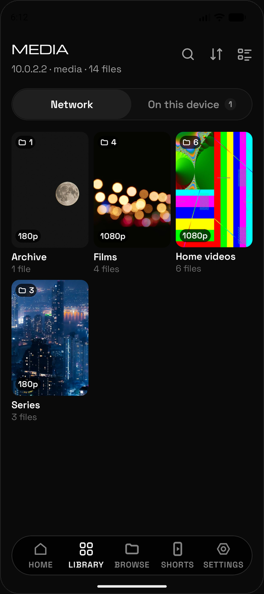
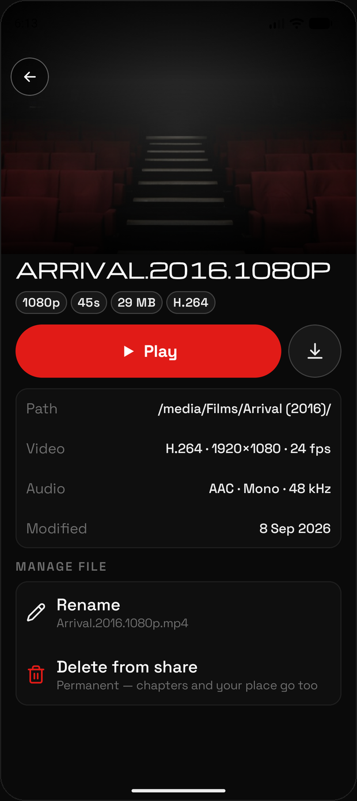
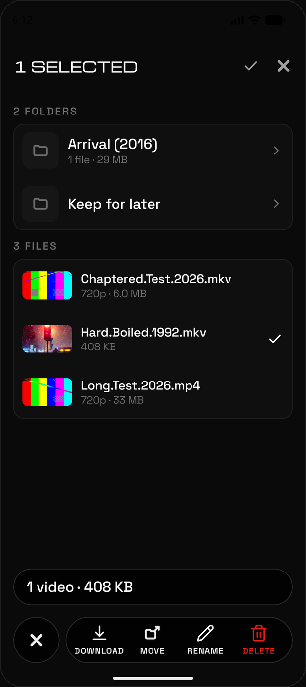

<p align="center">
  
</p>

<p align="center">
  <strong>Kotlin</strong> · <strong>Jetpack Compose</strong> · <strong>Media3</strong> · <strong>jcifs-ng</strong> · <strong>Android 14+</strong>
</p>

<p align="center">
  A native Android video player for the files on your own SMB share.<br>
  Nothing is copied off the share, and nothing leaves your network.
</p>

---

Regolith points at the NAS you already have and treats it like a media library:
posters, chapters, resume points, thumbnail scrubbing. It streams each file in
place over SMB rather than syncing a copy to the phone, so the library is however
big your share is. There is no account, no server to run beside it, and no
service that gets told what your files are.

<table>
  <tr>
    <td width="33%"></td>
    <td width="33%"></td>
    <td width="33%"></td>
  </tr>
  <tr>
    <td align="center"><sub>The library, built from the share</sub></td>
    <td align="center"><sub>A title, and what it really is</sub></td>
    <td align="center"><sub>Select, and the nav becomes a toolbar</sub></td>
  </tr>
</table>

## What it does

### Plays straight off the share

Point it at a share, pick the folders you actually want (`Films/` and `Series/`,
not `Backups/`), and it reads the shape of what's there. Playback is a custom
Media3 data source reading SMB directly, so a file starts without being copied
first. A LAN finder sweeps the Wi-Fi subnet if you don't know the address.

### Scrub by thumbnail

Drag the scrubber and frames appear above your finger, the way Jellyfin and Plex
do it. Every poster, thumbnail and backdrop is a real frame pulled off the share
— but pulled *ahead of time*, by a background job that walks the share once its
scan finishes, rather than while you are scrolling.

### Chapters you can write

Every file has chapters: the container's own markers, or an even split. The
player's chapter sheet has a pencil — mark a place at the playhead, name it, drag
its handle — and those become the film's chapters. Save writes a small
`mkvmerge`-format text file beside the video on the share, so the work is
readable by other tools and survives a reinstall. Search finds chapter names and
opens the film at that moment — and each result shows the frame *at* that moment,
so two marks in the same film are two different pictures rather than the film's
poster twice.

### Manages the files, not just the library

Hold any video — or any folder — to start picking, and the floating nav pill stops
being a nav and becomes that selection's toolbar: Download, Move, Rename, Delete.
A move is a **single rename on the server** — one metadata operation, nothing
copied — so it is instant, and a share that drops halfway leaves every video
either where it was or where it was going, never half-moved. That is measured
rather than assumed, by a probe suite run against a real Samba server.

Folders move and rename the same way, whole: the server does a directory and
everything under it in that same single operation. Deleting is permanent and asks
first, naming the size and saying that the chapters you wrote go with it — and for
a folder, that everything inside goes too, including files Regolith never listed.
When the folder you want to move something into doesn't exist yet, the move sheet
makes it for you and drops the files straight in.

### Takes a batch offline

The same toolbar queues downloads. Picking a folder takes everything inside it,
including folders the app has never scanned, which it walks over SMB as the
download runs. A foreground notification carries progress across the whole batch;
the copies live under **Library › On this device**.

A copy belongs to the phone, not to the share it came from. Disconnecting a
server takes its media list away and leaves everything already downloaded
where it is, re-homed under *On this device* with its resume point and any
chapters you wrote — the file keeps its identity, so nothing about it resets.

### Opens out on a foldable

The inner display gets its own layouts: a nav rail that retracts to a spine, the
library and browse walls beside a title pane with a divider you can reset, and
two-column and flex-mode player layouts.

### Locks itself

Settings › Privacy asks for a fingerprint, face or the phone's own screen lock
before the library is shown, and you choose how long the app may sit in the
background first. If the phone loses its screen lock entirely, the lock stands
down rather than shutting you out.

## Try it without a share

**Settings › Demo › Load** writes a pretend NAS — four collections, 18 titles, a
few part-watched — and copies four bundled test clips onto the device. Everything
plays, scrubs and shows real frame-grab posters with no network at all, which is
what makes the app reviewable on a train. **Remove** deletes it; nothing else is
touched.

The section is behind `BuildConfig.DEMO_LIBRARY`, true in both build types today
because the side-load (`assembleRelease`) build is the one that gets tested on a
phone. Set it false — and delete `res/raw/demo_*.mp4` — before any store upload.

## Install a build

Every push to `main` that touches the app builds it, runs the tests and lint,
and publishes a [release](https://github.com/Jmeza081/regolith/releases) with
the APK attached — notes grouped into what is new, what was fixed, and what
changed under the hood. Version numbers are semver, worked out from the
`Release:` trailers on the commits in that range (CLAUDE.md explains them).
A documentation-only push builds but publishes nothing; those commits appear in
the next release that ships.

Take the newest `regolith-x.y.z.apk` from that page. It installs over the
previous build, keeping your library, chapters and resume points.

## Build and run

You need Android Studio 2026.1 (for its bundled JDK 21 and the SDK), SDK platform
37, and an Android 14+ device or emulator.

```
# the gradlew launcher needs a JVM before it reads gradle.properties
export JAVA_HOME="/Applications/Android Studio.app/Contents/jbr/Contents/Home"

./gradlew assembleDebug        # compile
./gradlew installDebug         # build + install on a running emulator
./gradlew test                 # JVM unit tests
./gradlew connectedAndroidTest # Compose UI tests on a device
./gradlew lint
```

`local.properties` (gitignored) must contain
`sdk.dir=/Users/<you>/Library/Android/sdk` — Android Studio writes it on first
open, or create it by hand.

One JVM test talks to a local Samba fixture and skips without it. Emulator
driving and QA go through the argent MCP tools; see [`CLAUDE.md`](CLAUDE.md).

<details>
<summary><strong>Foldable emulator</strong></summary>

The inner display gets its own layouts ([`docs/FOLDABLE_PLAN.md`](docs/FOLDABLE_PLAN.md)).
The AVD `Samsung_Galaxy_Main_Display` matches the Galaxy Z Fold 8's inner
panel: **1848×2448 at 400 dpi**, which is 739×979 dp — so `wide` is true and
every two-pane layout is live there. The pixel count and the 7.6″ diagonal are
the real panel's (403.58 ppi); 400 is the nearest Android density bucket, and
`hw.lcd.density` wants a bucket, not the physical ppi.

It was written by hand — this machine has no `avdmanager` — so the display and
hinge keys in `~/.android/avd/Samsung_Galaxy_Main_Display.avd/config.ini` are
the whole profile:

```ini
hw.lcd.width=1848
hw.lcd.height=2448
hw.lcd.density=400
hw.sensor.hinge=yes
hw.sensor.hinge.areas=924-0-0-2448          # zero-width crease down the middle
hw.sensor.hinge.ranges=0-180
hw.sensor.hinge_angles_posture_definitions=0-30, 30-150, 150-180
hw.sensor.posture_list=1, 2, 3              # closed / half-opened / opened
```

The matching hardware profile in `~/.android/devices.xml` carries the same
numbers. Edit the AVD in Android Studio's Device Manager and it re-applies that
profile over `config.ini`, so the two have to move together.

Postures, once it is running:

```
adb shell cmd device_state print-states   # CLOSED=1, HALF_OPENED=2, OPENED=3
adb shell cmd device_state state 2        # half open; `state reset` releases it
adb shell settings get global display_features   # hinge-[924,0,924,2448]
adb logcat -s Regolith                    # prints "window shape: …" on every change (debug builds)
```

`WindowShape` (`ui/adaptive/`) is what the app sees, and the logcat line above
is the quickest way to watch it change.

**Two things this AVD cannot do**, both apparently because a generic
`google_apis` system image has no device-specific framework overlay:

- **No cover screen.** `hw.displayRegion.0.1.*` is ignored — folding to CLOSED
  leaves one 1848×2448 display. Compact-width checks need
  `adb shell wm size 1248x1972` to stand in for the outer panel; there is no
  phone AVD on this machine.
- **No tabletop.** Half open, the hinge is reported correctly and rotates with
  the window, but Material 3's `isTabletop` stays false, so the app sees
  `FLAT` where a real Fold would say `TABLE_TOP` and the player would go into
  flex mode. Flex mode is covered by `WindowShapeFoldTest` instead, which
  publishes a fake `FoldingFeature` and needs no hinge at all.

Both are observations about **this** AVD, and the overlay explanation predicts
its own exception. A second AVD, `Pixel_9_Pro_Fold`, is the SDK's own
`pixel_9_pro_fold` profile (2076×2152 @ 390 dpi) on a `google_apis_playstore`
API 37.2 image, and it *does* declare a cover region — so it may well manage
both. It is untested: the emulator needs roughly three times its data
partition free on the host and would not start. See
[`docs/FOLDABLE_PLAN.md`](docs/FOLDABLE_PLAN.md) for the checks to run if you
free the space.

So, today: `Samsung_Galaxy_Main_Display` is the one for the inner display and
for `BOOK`; flex mode is tested by `./gradlew connectedAndroidTest`, and
confirmed by eye only on real hardware.

</details>

<details>
<summary><strong>Naming a server, and choosing folders inside a share</strong></summary>

A server added by address is called by that address — `192.168.4.73` reads the
same as every other box on the network. After connecting, **Name this server**
offers a better one; leave it blank to keep what the app worked out (`TOWER` for
`tower.local`, the address itself for an IP). You can change it later in
**Settings › Shares**. The name is only a label — nothing is keyed to it, so
renaming touches no media, no progress and no downloads.

"Choose a share" takes whole shares; the chevron on each share opens **Choose
folders**, where you pick the folders you actually want in the library. In each
row the box picks the folder and the rest of the row opens it, so you can walk
down and pick at any depth — `Films` at the top and `Series/Severance/Season 02`
three levels in, with nothing chosen in between. An unpicked folder says how many
picks are below it, so a deep one is easy to find again.

Picks are written as `share_roots` rows; a share with none means the whole share,
so nothing changes for an install that never uses it. The library keeps the
share's real shape: the folders on the way down to a pick get a row each, but
they are never read off the share, and neither is anything outside a chosen
folder.

</details>

<details>
<summary><strong>Reaching your library from outside the house</strong></summary>

The share does not have to be on the same network as the phone. Put
[Tailscale](https://tailscale.com) on both — it is a WireGuard mesh that gives
every device a stable name and a private address wherever it is, and the free
Personal plan (6 users, unlimited devices, MagicDNS) covers this with room to
spare. Nothing is exposed to the public internet, which matters: an SMB share
on a forwarded port is not a thing to do.

**Add the server by its tailnet name, and use that name at home too.** A
server is keyed by `host` ([`ServerEntity`](app/src/main/java/com/regolith/data/db/Entities.kt)),
so adding `192.168.x.x` at home and `box.tailnet.ts.net` away makes *two*
servers — two scans, two libraries, two sets of artwork, and chapters and
resume points that do not follow you between them. One name avoids all of it,
and costs nothing at home: Tailscale connects two devices on the same network
directly, so the LAN path is still the LAN path.

Check that the connection is **direct** before blaming anything else. Tailscale
guarantees your devices can always reach each other; it does not guarantee they
do it peer-to-peer. When NAT traversal fails — which is most of the time on
cellular, because carrier CGNAT is usually hard NAT — it falls back to a DERP
relay, and every packet takes a detour through another city. The Tailscale app
says *Direct* or *Relayed* per peer; `tailscale status` shows a relay name
instead of an address when it is relayed.

That distinction matters more here than raw bandwidth, because SMB was built
for a LAN and is extremely chatty: a scan is thousands of small round trips, so
150 ms of extra latency is multiplied by thousands rather than paid once.
Relayed, expect scanning and artwork to crawl; on Wi-Fi with a direct path they
behave like they do at home. Streaming survives a relay far better than
scanning does — it is bulk sequential reads with read-ahead, so latency is paid
once and amortised — but it is still limited by the relay's throughput.

What actually limits a direct connection is **your home upload speed**, not the
VPN. Every byte leaves the house over your upstream. A 1080p file at 8–15 Mbps is
comfortable on most connections; a 4K remux at 60–80 Mbps wants symmetric
fibre. When the link is not up to it, **Downloads** is the better tool:
queue titles at home at full LAN speed and *On this device* plays them with no
network at all.

Two things on the machine holding the drive:

- It has to stay awake with the share mounted — `sudo pmset -c sleep 0`, or
  the Energy settings equivalent. Set `sudo pmset -c disksleep 0` too: a disk
  that has spun down can take most of a listing's budget just waking up.
- If playback takes a few seconds to start after a long idle, that is the disk
  spinning up, not the app. `pmset -g custom` shows `disksleep`; set it to `0`
  to keep an external media drive spinning.

</details>

<details>
<summary><strong>Artwork is made ahead of time</strong></summary>

Every poster, thumbnail and backdrop is a frame pulled off the share, which costs
a second or two each. Rather than doing that while you scroll, a background job
walks the share when its scan finishes and makes them all up front, showing a
progress notification you can stop. One frame grab writes all three sizes.

A library scanned before this existed has no walk queued for it: tap **Settings ›
Media › Prepare artwork**, or rescan the share.

The one exception is a point of interest's frame, which is grabbed when a search
result asks for it. The walk cannot make those ahead of time — there is no wall of
them to get ready, and a mark's frame is wanted by one row — so they are cached on
first sight and kept, under the mark's own time. Move a mark and its old frame is
dropped and a new one taken; rename it and nothing is re-read. If the file's key
frames are too far apart to land within ten seconds of the mark, the row shows the
film's own thumbnail instead, rather than a picture claiming to be a time it is not.

</details>

## How it's put together

- **Kotlin + Jetpack Compose**, Material 3, one Activity.
- **MVVM** with unidirectional data flow — each screen owns a single `StateFlow<UiState>`.
- **Navigation 3**, where the back stack is a plain list of serializable keys you hold as state.
- **Hilt** for dependency injection, **Room** for the library, **DataStore** for settings.
- **Media3 (ExoPlayer)** with a custom SMB data source; **jcifs-ng** for the share itself.
- Parsing, matching and artwork are all local — nothing is looked up online.

```
app/src/main/java/com/regolith/   ui/ · data/ · domain/ · di/ · player/
app/src/main/res/font/            Michroma + Space Grotesk (OFL), bundled
design/docs/                      the high-fidelity design export
docs/                             ARCHITECTURE.md · NAVIGATION.md · CHAPTERS.md
```

[`docs/ARCHITECTURE.md`](docs/ARCHITECTURE.md) is the decision log: every
architectural choice, what it replaced, and why.
[`docs/CHAPTERS.md`](docs/CHAPTERS.md) specifies the chapter file format.

## License

The bundled typefaces (Michroma, Space Grotesk) are under the SIL Open Font
License.
