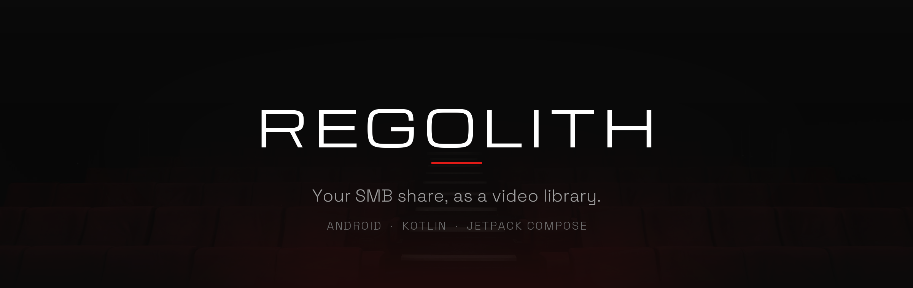
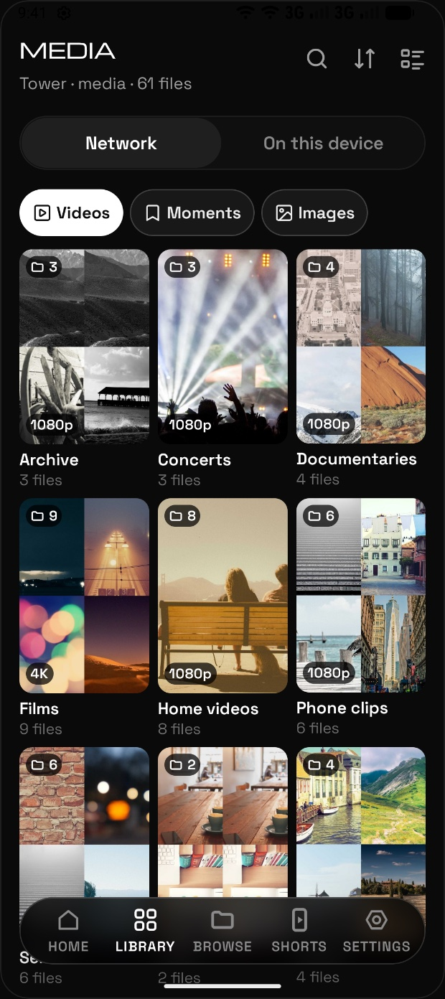
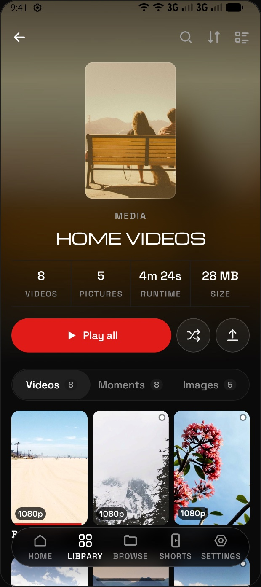
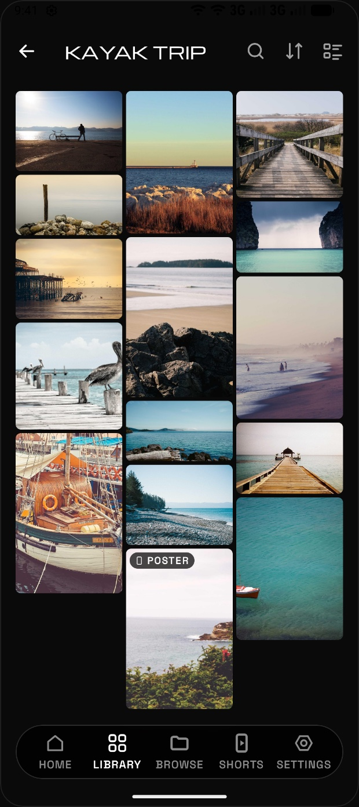
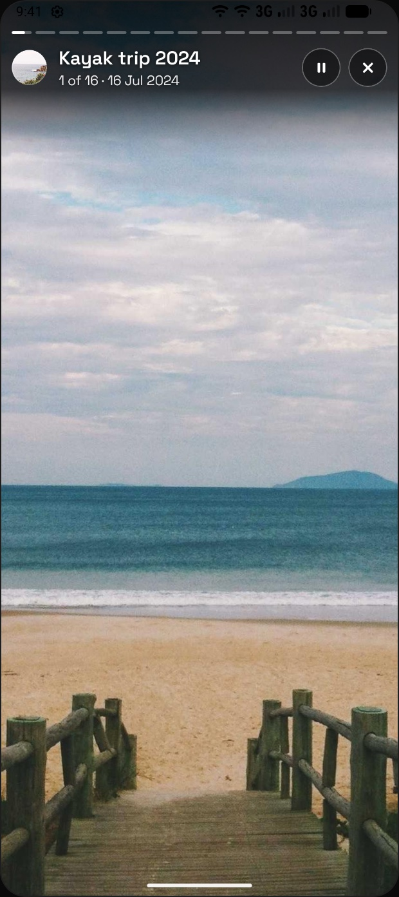
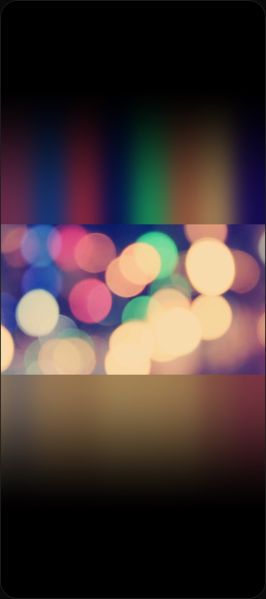
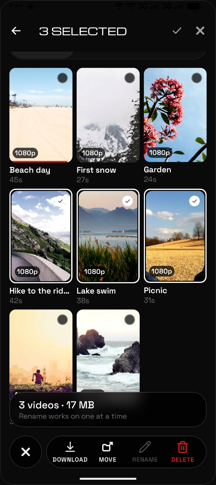
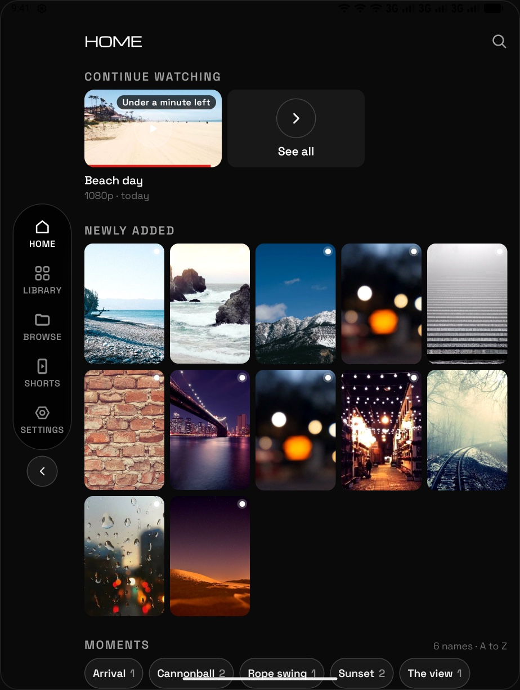

<p align="center">
  <picture>
    <source media="(prefers-color-scheme: dark)" srcset="docs/images/monogram-white.svg">
    
  </picture>
</p>

<p align="center">
  
</p>

<p align="center">
  <strong>Kotlin</strong> · <strong>Jetpack Compose</strong> · <strong>Media3</strong> · <strong>jcifs-ng</strong> · <strong>Android 14+</strong>
</p>

<p align="center">
  A native Android video player for the files on your own SMB share.<br>
  Nothing is copied off the share, and nothing leaves your network.
</p>

---

Regolith points at the NAS you already have and treats it like a media library:
posters, chapters, resume points, thumbnail scrubbing. It streams each file in
place over SMB rather than syncing a copy to the phone, so the library is however
big your share is. There is no account, no server to run beside it, and no
service that gets told what your files are.

<table>
  <tr>
    <td width="33%"></td>
    <td width="33%"></td>
    <td width="33%"></td>
  </tr>
  <tr>
    <td align="center"><sub>The library, built from the share</sub></td>
    <td align="center"><sub>A collection with a page of its own</sub></td>
    <td align="center"><sub>An album, each picture its own shape</sub></td>
  </tr>
  <tr>
    <td width="33%"></td>
    <td width="33%"></td>
    <td width="33%"></td>
  </tr>
  <tr>
    <td align="center"><sub>An album plays as a story</sub></td>
    <td align="center"><sub>Color bleed lights the room</sub></td>
    <td align="center"><sub>Select, and the nav becomes a toolbar</sub></td>
  </tr>
</table>

## What it does

### Plays straight off the share

Point it at a share, pick the folders you actually want (`Films/` and `Series/`,
not `Backups/`), and it reads the shape of what's there. Every folder of videos
is a collection in the Library, with its own poster, even one that holds a
single video, since you may add more later. Playback is a custom
Media3 data source reading SMB directly, so a file starts without being copied
first. A LAN finder sweeps the Wi-Fi subnet if you don't know the address.

A wall shows as posters or as rows, sorted by name, date added, file size,
runtime or resolution (tap the sort in use again to reverse it), and **Play all**
on a collection plays it in order or shuffled. A video's own page shows its
picture, its resolution, HDR and codec, **Resume** or **Play**, **Keep on this
device**, where it lives and what its video and audio are, with Rename and
Delete from share underneath.

A Library wall sorted by name, A to Z, with more than ten tiles gets the same
A–Z rail as the move sheet down its edge: slide a thumb down it to jump from
letter to letter, and the poster you land on gives a small nudge. On a
collection's page the rail comes once the top of the page has scrolled away.

### Home and Search

Home picks up where you were. **Continue watching** has a card for each film you
have started, with the time it has left (**See all** lists every one), **Newly
added** the twelve newest files, **On this device** what you have downloaded, and
**Moments** every name you have given a mark (see Chapters, below). Pull Home
down to read every share again.

Search finds titles, filenames and folders as you type, and the moments you
have named, each shown with the frame at its time: tap one and the film opens
there. Chips narrow the results to **Unwatched** or **4K**, and **Moment** picks one
name from all of the library's. Results come as rows or a grid, and your last
eight searches wait under **Recent**.

### Shorts

Shorts is the library's upright clips as a feed: every video on your shares that
is taller than it is wide and no longer than **Settings › Shorts › Longest clip**
(30, 60 or 90 seconds). Swipe up for the next, tap to pause, and hold the right
half of the screen for double speed. Each visit deals a fresh shuffle, and
tapping the tab again deals another. The buttons down the side pick a folder to
play from, turn shuffle and auto-advance on or off, show the clip in Browse,
keep it on the phone, and set the sound and brightness. On Wi-Fi the first few
seconds of the next clips are fetched in the background while you are elsewhere
in the app, so Shorts opens on a clip that is already playing.

### A player run by your thumb

The controls stay out of the way until you want them. Tap to show them,
double-tap the middle to pause, double-tap either side to jump ten seconds (keep
tapping and the jumps add up), and hold for double speed for as long as your
finger stays down. Drag the left edge for brightness and the right edge for
volume, swipe up for full screen and down to leave it or put the player away,
and pinch to fill the screen or fit the picture. The first time you go full
screen sideways, it shows where those zones are.

Under the picture sit **Chapters**, an **A–B loop** that repeats a stretch until
you clear it, a rotation lock, **Keep on this device**, and **Playback**: speed
(0.75× to 2×), the hardware or software decoder, scrub thumbnails, Ambient light,
and **Keep playing**, which goes on to the next video in the folder after a
ten-second Up next card, or at once with **Don't ask first**. Full screen adds
shuffle and repeat (all, or one). A film you stopped part-way opens where you left
it, until you have seen nearly all of it.

### Keeps playing while you look around

Put the player away (back, a swipe down, or its arrow) and the film shrinks into
a bar above the nav on a phone, or a card in the corner of the inner display,
and keeps playing while you browse. It lands whole, as the player showed it,
so an upright phone video stays upright rather than cropped. Tap it to bring
the player back, or ✕ to stop. A queue, a repeat or Keep playing goes on to the next film by itself while
it is small; a film with nothing after it closes the bar when it ends.

Leave Regolith while a film plays and it carries on in a small window over your
other apps (**Settings › Playback › Picture-in-picture**, on to start with);
the window has play, pause, previous and next, and opening it out puts you back
where you were. The lock screen and the notification shade show what is playing
with the same buttons, and headphones coming out pause it. With the screen off
the film pauses, unless **Play with the screen off** is on, when the sound
carries on; leaving the app with picture-in-picture off pauses it too.

### Collections with a page of their own

Open a collection that holds videos or pictures, and no collections, and it
opens as its own page rather than a plain wall. Its poster lights the top of the
page, the way the player lights the room around a film. Under it, up to four
figures (how many videos and pictures it holds, how long they run, how much
space they take, how many you have watched), then Play all, Shuffle, and its
tabs. **Videos** is the wall you know. **Moments** lists every chapter you have
named in those videos, each with the frame at its time, and plays from there.
**Images** is its pictures (below). A collection with collections inside stays a
wall: only the last one down a branch gets a page.

On the Moments tab, **Play moments** plays them as a reel: ten seconds of each
(less when the next one in the same video comes sooner), one after another with
no wait between, in the tab's order, or scrambled with the shuffle beside it.
Bars across the top of the picture show where you are, each moment's name comes
up as it starts, and **Watch from here** leaves the reel for the whole video,
carrying on from that moment. A reel isn't watching: it leaves no resume points
and adds nothing to Continue watching.

### Pictures on the share

The photos on your share are part of the library, not only artwork. Chips under
the Library's tabs choose what a wall shows: **Videos**, the collections and
videos as always; **Moments**, the collections whose videos have named moments,
each opening on its Moments tab; and **Images**, the albums: every folder that
holds pictures, with any picture lying loose beside them. A folder of nothing
but photos, which the wall used to leave out, is an album now, its cover made of
its four newest pictures.

A collection's **Images** tab is a mosaic: columns of one width, each picture at
its own shape, the newest taken first (or by name, or by when a scan found it).
Pinch it for fewer, bigger columns or more, smaller ones: two to four across on
a phone, three to seven on the inner display, remembered apart from the
posters. The collection's own poster is among them, marked, and so is a video's
own picture (`beach.jpg` beside `beach.mp4`), carrying the video's name.

Tap a picture and it flies open in the lightbox. Swipe for the next one, pinch or
double-tap to zoom, and swipe down to send it back into its tile. The bar says
where it is in the album and when it was taken; **Details** adds what it was
taken on, how big it is and where it lives. The inner display adds a strip of
the album to jump about in. JPEG, PNG, WebP, GIF (which moves in the lightbox),
HEIC and AVIF are pictures; raw files stay plain files in Browse.

Each picture's shape and date are read from its first few kilobytes, after a
scan or as soon as its album is opened, so the mosaic is laid out before any
thumbnail arrives. The thumbnails are made in the background after a scan,
once the videos' posters are done.

Pictures are looked after where they are. Hold one in the mosaic (or in Browse)
to start picking, and the pill offers **Move**, **Rename**, **Save**, **Poster**
and **Delete**: Save copies them into the phone's gallery, under Pictures ›
Regolith, where any other app can use them; Poster makes the one picked its
collection's poster. The lightbox has the same at hand: **Set as poster**,
**Play from here** and **More** (Rename, Move to…, Save to phone, Details,
Delete from share), up in its bar on the inner display. Renaming a video's own picture says it will stop being
that video's, and deleting a collection's poster says what its tile falls back
to — another picture of its own, or a mosaic.

**Set as poster** frames the picture 2:3: pinch and drag it behind the box, and
the crop is saved as `poster.jpg` while the picture itself stays as it is. Or
**Use whole picture**: a JPEG, PNG, WebP or GIF of 8 MB or less simply becomes
the poster, renamed `poster.jpg` (or `.png` and so on); a HEIC, or anything
bigger, is copied as a `poster.jpg` sized for a poster and left as it was.

A collection's pictures also play as a story. **Play pictures** on its Images
tab (with Shuffle beside it), or **Play from here** in the lightbox, shows them
one at a time across the whole screen, with a bar of segments along the top that
fill as they go: tap the right of the screen for the next picture and the left
for the one before, hold to pause (let go and the same picture carries on), and
swipe down to close. Each picture stays
for the time set in **Settings › Playback › Picture stories** — 3, 5 or 8
seconds — and a moving GIF plays through once, however long that takes. A long
album's bar shows the twenty around the picture up and slides along. On a phone
a picture about the screen's own shape (an upright 9:16 shot, say) fills it; any
other, and every picture on the inner display, is shown whole over a blurred
copy of itself. The next picture is fetched while this one shows, so none
arrives late.

### Posters that fly

Tap a poster and it flies to where its page shows it. A video's poster grows
into the wide picture at the top of its page, uncropping as it goes, and a
collection's poster settles into its place on the collection's page, while the
page fades in around it. Back flies it home, and on a phone the back swipe
holds it under your thumb. On the inner display it flies into the page beside
the wall too; closing that page slides it away as before.

Play does the same: the picture at the top of a video's page, or a Continue
watching card's, flies into the player's picture while the player fades in
under it, and the film starts as it lands. Until the film's first frame is
drawn the player shows that picture rather than a black box, which is what you
see while a film opens from the share.

### Lights the room around the picture

A film rarely fills the screen exactly, and the bars around it carry its own
colour instead of black. Settings › Display › Ambient light picks how. **Mirror**
fills the space with a soft, blurred copy of the picture. **Color bleed** does
what a Govee or Ambilight strip does behind a TV: it reads the colour along each
edge of the picture, zone by zone, and shines it outward as one soft glow, each
zone's colour flowing into the next. Both follow the film
as it plays; **Off** keeps a still glow from its artwork and saves the battery
the live ones cost.

### Scrub by thumbnail

Drag the scrubber and frames appear above your finger, the way Jellyfin and Plex
do it. Every poster, thumbnail and backdrop is a real frame pulled off the share
— but pulled *ahead of time*, by a background job that walks the share once its
scan finishes, rather than while you are scrolling.

### Chapters you can write

Every file has chapters: the container's own markers, or an even split. The
player's chapter sheet has a pencil — mark a place at the playhead, name it, drag
its handle — and those become the film's chapters. Save writes a small
`mkvmerge`-format text file beside the video on the share, so the work is
readable by other tools and survives a reinstall; **Settings › Chapters** can keep
a share's chapters on the phone instead, share by share, and clears them all.
Search finds chapter names and
opens the film at that moment — and each result shows the frame *at* that moment,
so two marks in the same film are two different pictures rather than the film's
poster twice.

Home ends with **Moments**: every name you have given a mark, A to Z, each with
how many videos use it, wrapping across the screen rather than hiding in a
sideways row. Tap one and Search opens with that name already picked, listing
every place it appears and every video it is in.

### Posters you choose

Don't like the frame a folder picked? "Make a poster from this frame", at the
foot of the player's Playback settings, opens an editor on the frame you paused
at: scrub, type a time or step a frame at a time, then drag and pinch the picture
behind a 2:3 box and save. It is written as `poster.jpg` in the film's folder on
the share and becomes that folder's poster: every folder is a collection, and
its poster is the collection's, even when it holds a single film. Every tile
showing it picks it up at once.

A poster is never written over. Wherever a new one comes from — a frame, a
picture on the share, one from the phone — the one there now is kept, renamed
with the day it stopped being the poster (`poster.jpg` becomes
`poster (8 Oct).jpg`), and stays in the folder as an ordinary picture under
Images. A sheet shows both before anything changes: the old poster and the name
it will keep, beside the new one.

Pictures changed on the share are noticed too. Replace a folder's `folder.jpg` or
`poster.jpg` with a different picture — even under the same name — or put an
`Arrival.2016.jpg` beside `Arrival.2016.mkv`, and the app makes the tile again the
next time it lists that folder: when you open it, pull Home down, or scan the
share. One uploaded from the phone is noticed as soon as the upload lands.

### Manages the files, not just the library

Hold any video, collection or folder (in the Library, Browse or Search) to start
picking, and the floating nav pill stops being a nav and becomes that selection's
toolbar: Download, Move, Rename, Delete. The same four work the same way on
every screen; Search, which has no nav of its own, brings the toolbar up just for
the pick. In the Library a collection is moved, renamed and deleted as its
folder, and a video as itself and the files beside it that share its name.
A move is a **single rename on the server** — one metadata operation, nothing
copied — so it is instant, and a share that drops halfway leaves every video
either where it was or where it was going, never half-moved. That is measured
rather than assumed, by a probe suite run against a real Samba server.

A video's own files travel with it. Everything beside it that shares its name
(`beach.en.srt`, `beach.chapters.txt` and `beach.jpg` beside `beach.mp4`) is
renamed to match, moved and deleted along with it, and the delete dialog counts
them. If one of those names is already taken where the video is going, nothing
happens and the app says which name. A folder's own poster stays with the folder.

Folders move and rename the same way, whole: the server does a directory and
everything under it in that same single operation. Deleting is permanent and asks
first, naming the size and saying that the chapters you wrote go with it — and for
a folder, that everything inside goes too, not just its videos.
When the folder you want to move something into doesn't exist yet, the move sheet
makes it for you and drops the files straight in. However long the folder list,
the Move button stays at the foot of the sheet, and a folder with more than ten
subfolders gets an A–Z rail down the edge: slide a thumb down it to jump from
letter to letter.

Browse shows a folder the way a file manager would. After its folders and
videos come all its other files, by their real names and sizes: the poster,
subtitles, chapters, an `.nfo`, anything else. The Library leaves those out
and puts them to use instead. Hold one to pick it, and it moves, renames and
deletes like a video, but on its own: a subtitles file picked by itself leaves
its video where it is. They never download, since what Download keeps on the
phone is videos to play. Moving, renaming or deleting a folder's poster this
way changes the folder's tile at once.

Because a folder moves and deletes whole, Move and Delete refuse when you have
picked a folder and then taken something back out of it. Moving or deleting the
folder would take that too, so the app says so and asks you to open the folder
and pick what to move or delete. Download leaves the un-picked part out by itself.

### Takes a batch offline

The same toolbar queues downloads. Picking a folder takes everything inside it,
including folders the app has never scanned, which it walks over SMB as the
download runs. A foreground notification carries progress across the whole batch;
the copies live under **Library › On this device**, and **Settings › Downloads**
says what is still arriving and how much room the copies take.

A copy belongs to the phone, not to the share it came from. Disconnecting a
server takes its media list away and leaves everything already downloaded
where it is, re-homed under *On this device* with its resume point and any
chapters you wrote — the file keeps its identity, so nothing about it resets.

### Sends files the other way

Inside any folder on a share, **Upload to this folder** (the arrow in Browse's
top bar) sends things from the phone into it: **Photos and videos** from the
gallery, through Android's own photo picker, or **Files** of any kind through
the system's file picker — no permission asked either way. Picking is the whole
confirmation. The files appear at the top of the folder with their own
thumbnails, each saying where it stands, and a line above the nav pill follows
the batch from anywhere else in the app. A video that lands is a video in the
library at once; a photo or any other file lands among the folder's other files
in Browse.

A collection in the Library takes new pictures and videos the same way. **Add
to this collection**, in its top bar or beside Play all on a collection's own
page, offers photos and videos from the gallery, any picture or video file, and
a poster for its tile, and the uploads show at the top of its page. Pictures go
up as they are — a HEIC stays a HEIC — and land under Images once they are
there. The gallery hides a photo's own name, so a camera shot is named for the
moment it was taken (`20241008_153212.jpg`), which is the name a Samsung camera
gave it; the file picker keeps any file's real name.

It is built for the ways uploads go wrong. If the Wi-Fi drops or the NAS
sleeps, the batch waits and carries on by itself from the bytes already sent —
a 600 MB video is never sent twice. A full share, a read-only folder, a
password that changed or a photo deleted from the gallery each fail with their
own sentence and their own fix, and the rest of the batch carries on. A name
that is already taken is asked about once for the whole pick — keep both, skip,
or replace — except the same file sent twice, which is simply skipped.
Nothing half-written ever sits on the share under a real name.

**Folder poster**, the third choice under Upload (**Collection poster** on a
Library collection), makes one picture from the phone the folder's own poster.
It opens in Set as poster to be framed 2:3 first (or used whole), and is saved
as `poster.jpg` — the first name Regolith looks for, and one every media server
reads — the right way up and as a JPEG, whatever the phone took it as. Every
tile showing the folder changes at once. A picture of its own already there (a
`folder.jpg`, a `cover.png`, an older `poster.jpg`) is kept under the day's
name, as above.

A GIF can be a poster too. For a top-level folder — a collection on the
Library's first screen — it moves there: Upload › Folder poster sends it
unchanged as `poster.gif`, and a `poster.gif` already on the share plays the
same way. Anywhere else, or over 8 MB, a GIF is a still of its first frame.
Android's Remove animations setting (Settings › Accessibility) holds them still.

### Plays what the phone already has

**Library › On this device** also lists the videos that were on the phone before
Regolith was: Camera, Movies, Download, Telegram and any other folder with a
video in it. Downloads from a share sit above them, labelled with the server
they came from, so a copy and a video only the phone has are never confused.
Chips across the top narrow the page to the downloads or to one folder, and
**Settings › Phone folders** switches noisy ones (WhatsApp, screen recordings)
off. Nothing is moved or copied: the app asks for Android's video permission
from that tab, and "Select videos" works too. Phone videos get resume points,
scrub thumbnails, chapters and Search like everything else. From Title Detail
they can be hidden from Regolith, or deleted from the phone through Android's
own confirmation. Other apps can hand a video over too: Regolith is in Android's
"Open with" list as **Play in Regolith**.

### Opens out on a foldable

<p align="center">
  
</p>

The inner display gets its own layouts: a nav rail that retracts to a spine
(**Settings › Display › Auto-hide the navigation**, after 5, 10 or 30 seconds
untouched; on a phone it tucks the pill away while you scroll down), and
library and browse walls that fill the screen until you open a title, whose page
then opens beside the wall, its poster flying in, and slides away again when
you close it. The
Library and Home show four to seven posters across, as you pick in Settings ›
Display › Posters per row, or by pinching a wall: spread two fingers for fewer,
bigger posters and pinch them together for more, one step at a time, each with
a tick you feel and an "N across" pill at the top of the wall. With a title open
beside it, the posters keep their size and fewer fit. The
player has two-column and flex-mode layouts. Turned sideways, Shorts plays the clip in
one half and fills the other with its frames — tap one to jump there, pause to make
a poster from that moment — and the clips that play next.

### Locks itself

Settings › Privacy asks for a fingerprint, face or the phone's own screen lock
before the library is shown, and you choose how long the app may sit in the
background first. If the phone loses its screen lock entirely, the lock stands
down rather than shutting you out. A film floating over other apps counts as
time away: open it out after that long and the lock asks first. While the lock is
on, the lock screen and the notification say only "Regolith · Playing".

## Try it without a share

**Settings › Demo › Load** writes a pretend NAS — Films, Series, Documentaries
and Home videos, 26 videos in all, four of them part-watched and six of them
upright phone clips for Shorts, and **Photos**, three albums of painted pictures
(one with a poster of its own), with four more pictures among the phone clips —
and copies five bundled test clips onto the device, painting the pictures as it
goes. Everything
plays, scrubs and shows real frame-grab posters with no network at all, which is
what makes the app reviewable on a train. **Remove** deletes it; nothing else is
touched. Nothing in it can be moved, renamed or deleted: there is no share
behind it, so those verbs stay grey and the pill says why.

## Show it without showing your library

**Settings › Demo › Spoof mode** makes up every name and picture the app shows
from your own library, for a demo, a screen recording or a screenshot. Videos,
folders, paths and the chapters you named get believable made-up titles
("Quiet Lantern (2016)", keeping the year and "S01E02"), and every poster,
thumbnail and backdrop is a low-resolution stock photo from Unsplash, through
Lorem Picsum. Each video keeps the same stand-ins every time, so it still reads
as one library. Only the phone's display changes: the share is never touched,
the lock screen (which shows no picture) and the download notification are made
up too, and
nothing can be moved, renamed, deleted or uploaded until it is switched off.
The photos are the one thing it fetches from the internet, picked by a random
number that says nothing about the file.

The section is behind `BuildConfig.DEMO_LIBRARY`, true in both build types today
because the side-load (`assembleRelease`) build is the one that gets tested on a
phone. Set it false — and delete `res/raw/demo_*.mp4` — before any store upload.

## Install a build

Every push to `main` that touches the app builds it, runs the tests and lint,
and publishes a [release](https://github.com/Jmeza081/regolith/releases) with
the APK attached — notes grouped into what is new, what was fixed, and what
changed under the hood. Version numbers are semver, worked out from the
`Release:` trailers on the commits in that range (CLAUDE.md explains them).
A documentation-only push builds but publishes nothing; those commits appear in
the next release that ships.

Take the newest `regolith-x.y.z.apk` from that page. It installs over the
previous build, keeping your library, chapters and resume points.

## Build and run

You need Android Studio 2026.1 (for its bundled JDK 21 and the SDK), SDK platform
37, and an Android 14+ device or emulator.

```
# the gradlew launcher needs a JVM before it reads gradle.properties
export JAVA_HOME="/Applications/Android Studio.app/Contents/jbr/Contents/Home"

./gradlew assembleDebug        # compile
./gradlew installDebug         # build + install on a running emulator
./gradlew test                 # JVM unit tests
./gradlew connectedAndroidTest # Compose UI tests on a device
./gradlew lint
```

`local.properties` (gitignored) must contain
`sdk.dir=/Users/<you>/Library/Android/sdk` — Android Studio writes it on first
open, or create it by hand.

One JVM test talks to a local Samba fixture and skips without it. Emulator
driving and QA go through the argent MCP tools; see [`CLAUDE.md`](CLAUDE.md).

<details>
<summary><strong>Foldable emulator</strong></summary>

The inner display gets its own layouts ([`docs/FOLDABLE_PLAN.md`](docs/FOLDABLE_PLAN.md)).
The AVD `Samsung_Galaxy_Main_Display` matches the Galaxy Z Fold 8's inner
panel: **1848×2448 at 400 dpi**, which is 739×979 dp — so `wide` is true and
every two-pane layout is live there. The pixel count and the 7.6″ diagonal are
the real panel's (403.58 ppi); 400 is the nearest Android density bucket, and
`hw.lcd.density` wants a bucket, not the physical ppi.

It was written by hand — this machine has no `avdmanager` — so the display and
hinge keys in `~/.android/avd/Samsung_Galaxy_Main_Display.avd/config.ini` are
the whole profile:

```ini
hw.lcd.width=1848
hw.lcd.height=2448
hw.lcd.density=400
hw.sensor.hinge=yes
hw.sensor.hinge.areas=924-0-0-2448          # zero-width crease down the middle
hw.sensor.hinge.ranges=0-180
hw.sensor.hinge_angles_posture_definitions=0-30, 30-150, 150-180
hw.sensor.posture_list=1, 2, 3              # closed / half-opened / opened
```

The matching hardware profile in `~/.android/devices.xml` carries the same
numbers. Edit the AVD in Android Studio's Device Manager and it re-applies that
profile over `config.ini`, so the two have to move together.

Postures, once it is running:

```
adb shell cmd device_state print-states   # CLOSED=1, HALF_OPENED=2, OPENED=3
adb shell cmd device_state state 2        # half open; `state reset` releases it
adb shell settings get global display_features   # hinge-[924,0,924,2448]
adb logcat -s Regolith                    # prints "window shape: …" on every change (debug builds)
```

`WindowShape` (`ui/adaptive/`) is what the app sees, and the logcat line above
is the quickest way to watch it change.

**Two things this AVD cannot do**, both apparently because a generic
`google_apis` system image has no device-specific framework overlay:

- **No cover screen.** `hw.displayRegion.0.1.*` is ignored — folding to CLOSED
  leaves one 1848×2448 display. Compact-width checks need
  `adb shell wm size 1248x1972` to stand in for the outer panel; there is no
  phone AVD on this machine.
- **No tabletop.** Half open, the hinge is reported correctly and rotates with
  the window, but Material 3's `isTabletop` stays false, so the app sees
  `FLAT` where a real Fold would say `TABLE_TOP` and the player would go into
  flex mode. Flex mode is covered by `WindowShapeFoldTest` instead, which
  publishes a fake `FoldingFeature` and needs no hinge at all.

Both are observations about **this** AVD, and the overlay explanation predicts
its own exception. A second AVD, `Pixel_9_Pro_Fold`, is the SDK's own
`pixel_9_pro_fold` profile (2076×2152 @ 390 dpi) on a `google_apis_playstore`
API 37.2 image, and it *does* declare a cover region — so it may well manage
both. It is untested: the emulator needs roughly three times its data
partition free on the host and would not start. See
[`docs/FOLDABLE_PLAN.md`](docs/FOLDABLE_PLAN.md) for the checks to run if you
free the space.

So, today: `Samsung_Galaxy_Main_Display` is the one for the inner display and
for `BOOK`; flex mode is tested by `./gradlew connectedAndroidTest`, and
confirmed by eye only on real hardware.

</details>

<details>
<summary><strong>A server's name, its addresses, and the folders it brings</strong></summary>

A server added by address is called by that address — `192.168.4.73` reads the
same as every other box on the network. After connecting, **Name this server**
offers a better one; leave it blank to keep what the app worked out (`TOWER` for
`tower.local`, the address itself for an IP). You can change it later on the
server's own page (tap it in **Settings**, then **Rename**). The name is only a
label — nothing is keyed to it, so renaming touches no media, no progress and no
downloads.

The same page holds everything else about that server: **How to reach it** lists
its addresses (add another, such as a VPN name for when you are away, and
**Automatic** tries them all at once and uses whichever answers first), **Shares
and folders** changes what is in the library, and **Scan** and **Artwork** read
the share again or make its pictures. **Disconnect** takes its media list away
and leaves your downloads on the phone.

"Choose a share" takes whole shares; the chevron on each share opens **Choose
folders** (later, **Shares and folders** on the server's page), where you pick
the folders you actually want in the library. In each
row the box picks the folder and the rest of the row opens it, so you can walk
down and pick at any depth — `Films` at the top and `Series/Severance/Season 02`
three levels in, with nothing chosen in between. An unpicked folder says how many
picks are below it, so a deep one is easy to find again.

Picks are written as `share_roots` rows; a share with none means the whole share,
so nothing changes for an install that never uses it. The library keeps the
share's real shape: the folders on the way down to a pick get a row each, but
they are never read off the share, and neither is anything outside a chosen
folder.

</details>

<details>
<summary><strong>Reaching your library from outside the house</strong></summary>

The share does not have to be on the same network as the phone. Put
[Tailscale](https://tailscale.com) on both — it is a WireGuard mesh that gives
every device a stable name and a private address wherever it is, and the free
Personal plan (6 users, unlimited devices, MagicDNS) covers this with room to
spare. Nothing is exposed to the public internet, which matters: an SMB share
on a forwarded port is not a thing to do.

**Give the server its tailnet name as a second address.** On the server's page,
**How to reach it › Add another address** takes `box.tailnet.ts.net` beside the
LAN address, and **Automatic** tries every address at once and uses whichever
answers first: the LAN at home, the tailnet away. It stays one server — one
scan, one library, one set of artwork, and chapters and resume points that
follow you — where adding the tailnet name as a server of its own would make a
second library with nothing carried over
([`ServerAddressEntity`](app/src/main/java/com/regolith/data/db/Entities.kt)
says why). Tailscale connects two devices on the same network directly, so the
tailnet name costs nothing at home either.

Check that the connection is **direct** before blaming anything else. Tailscale
guarantees your devices can always reach each other; it does not guarantee they
do it peer-to-peer. When NAT traversal fails — which is most of the time on
cellular, because carrier CGNAT is usually hard NAT — it falls back to a DERP
relay, and every packet takes a detour through another city. The Tailscale app
says *Direct* or *Relayed* per peer; `tailscale status` shows a relay name
instead of an address when it is relayed.

That distinction matters more here than raw bandwidth, because SMB was built for
a LAN and is extremely chatty: a scan is thousands of small round trips, so 150
ms of extra latency is multiplied by thousands rather than paid once. Relayed,
expect scanning and artwork to crawl; on Wi-Fi with a direct path they behave
like they do at home. The app holds back on its own: when a faster way in exists
but cannot be reached from where you are, the server's page says **Waiting for a
faster way in**, with how long reading the whole share would take from here, and
scans and artwork wait until you are somewhere faster or tap **Read it anyway**.
Playing and downloading carry on regardless. Streaming survives a relay far
better than scanning does — it is bulk sequential reads with read-ahead, so
latency is paid once and amortised — but it is still limited by the relay's
throughput.

What actually limits a direct connection is **your home upload speed**, not the
VPN. Every byte leaves the house over your upstream. A 1080p file at 8–15 Mbps is
comfortable on most connections; a 4K remux at 60–80 Mbps wants symmetric
fibre. When the link is not up to it, **Downloads** is the better tool:
queue titles at home at full LAN speed and *On this device* plays them with no
network at all.

Two things on the machine holding the drive:

- It has to stay awake with the share mounted — `sudo pmset -c sleep 0`, or
  the Energy settings equivalent. Set `sudo pmset -c disksleep 0` too: a disk
  that has spun down can take most of a listing's budget just waking up.
- If playback takes a few seconds to start after a long idle, that is the disk
  spinning up, not the app. `pmset -g custom` shows `disksleep`; set it to `0`
  to keep an external media drive spinning.

</details>

<details>
<summary><strong>Artwork is made ahead of time</strong></summary>

Every poster, thumbnail and backdrop is a frame pulled off the share, which costs
a second or two each. Rather than doing that while you scroll, a background job
walks the share when its scan finishes and makes them all up front, showing a
progress notification you can stop. One frame grab writes all three sizes.

A library scanned before this existed has no walk queued for it: tap **Settings ›
Media › Prepare artwork**, or rescan the share. **Artwork cache**, above it, says
how much room the pictures take and clears them.

Points of interest are made ahead of time too. After the folders, the walk grabs the
frame at every *named* mark (the only kind Search shows), before it moves on to the
films, so Search already has its pictures. All of one film's marks come from a
single open of the file, which costs little more than one mark on its own. A mark
named since the last walk is grabbed the first time Search shows it, along with any
other marks in that film still missing a picture. Frames are kept under the mark's
own time: move a mark and its old frame is dropped and a new one taken; rename it
and nothing is re-read. If the file's key frames are too far apart to land within
ten seconds of the mark, the row shows the film's own thumbnail instead, rather
than a picture claiming to be a time it is not. That stand-in is tried again after
a day, in case the grab only failed because the share was down.

A folder with no poster of its own gets a 2×2 mosaic of frames from the videos
inside it. If a folder is scanned while it is still empty, and the videos are
copied in later, the next scan that finds them clears the "no picture" record so
the mosaic gets made.

</details>

## How it's put together

- **Kotlin + Jetpack Compose**, Material 3, one Activity.
- **MVVM** with unidirectional data flow — each screen owns a single `StateFlow<UiState>`.
- **Navigation 3**, where the back stack is a plain list of serializable keys you hold as state.
- **Hilt** for dependency injection, **Room** for the library, **DataStore** for settings.
- **Media3 (ExoPlayer)** with a custom SMB data source; **jcifs-ng** for the share itself.
- Parsing, matching and artwork are all local — nothing is looked up online.

```
app/src/main/java/com/regolith/   ui/ · data/ · domain/ · di/ · player/
app/src/main/res/font/            Michroma + Space Grotesk (OFL), bundled
design/docs/                      the high-fidelity design export
docs/                             ARCHITECTURE.md · NAVIGATION.md · CHAPTERS.md
```

[`docs/ARCHITECTURE.md`](docs/ARCHITECTURE.md) is the decision log: every
architectural choice, what it replaced, and why.
[`docs/CHAPTERS.md`](docs/CHAPTERS.md) specifies the chapter file format.

## License

The bundled typefaces (Michroma, Space Grotesk) are under the SIL Open Font
License.
